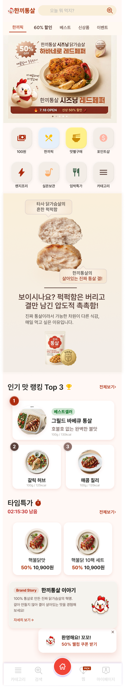
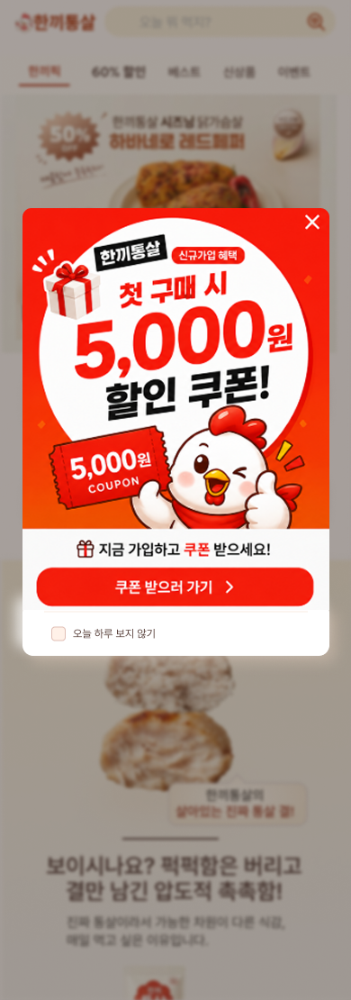
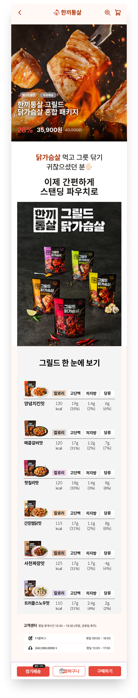
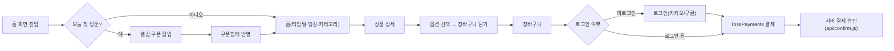

# 🍗 한끼통살 — 닭가슴살 다이어트 식단 이커머스

> 퍽퍽함은 버리고 결만 남긴 진짜 통살 — "오늘 뭐 먹지?" 고민을 해결하는 닭가슴살 쇼핑몰

<p>
  
  
  
  
  
  
  
</p>

## 🖼️ 구현 결과
| 홈 화면(반응형) | 웰컴 쿠폰 팝업 | 상품 상세 · 옵션 선택 |
|---|---|---|
|  |  |  |

배포 링크: [health-weld-three.vercel.app](https://health-weld-three.vercel.app/) · [GitHub Repo](https://github.com/seochaewon11/health) · [Notion 기획서](https://app.notion.com/p/Project-2-3d4c080e90c08102bc73d761a6437fec)

## ✨ 주요 기능 & 인터랙션

### 1. 3단계 프롬프트로 완성한 반응형 레이아웃
"구조 선언 → 요소별 변화 지정 → 브레이크포인트 명시" 3단계로 나눠 AI에게 순서대로 프롬프트를 입력해 완성했습니다. 480px를 기준으로 데스크탑(좌측 40% 브랜드 소개 + 우측 60% 서비스 프리뷰)과 모바일(단일 컬럼 + 하단 고정 탭바) 레이아웃이 통째로 전환되고, 폰트는 `clamp()`로 375px~480px 구간에서도 줄바꿈이 깨지지 않도록 처리했습니다.

### 2. 타임딜 카운트다운 & 웰컴 쿠폰 팝업
타임딜 섹션은 종료 시각을 `localStorage`에 저장해, 새로고침해도 남은 시간이 이어서 줄어듭니다. 방문 시 뜨는 웰컴 팝업은 "다시 보지 않기까지 남은 시간"을 `localStorage`에 기록해 하루에 한 번만 노출되며, 팝업에서 쿠폰을 받으면 마이페이지 쿠폰함 상태에 즉시 반영됩니다.

### 3. 카카오/구글 로그인 & 토스페이먼츠 결제
Firebase Authentication으로 구글 로그인을, 카카오 SDK로 카카오 로그인을 지원하고 로그인 상태는 `localStorage`로 유지해 새로고침 후에도 헤더 인증 버튼·장바구니 배지가 그대로 남습니다. 결제는 프론트에서 TossPayments 위젯으로 요청을 띄우고, 발급된 `paymentKey`·`orderId`·`amount`를 Vercel 서버리스 함수(`api/confirm.js`)로 넘겨 시크릿 키로 승인하는 서버 검증 결제 흐름을 구현했습니다.

## 🧭 사용자 플로우


## 🗂️ 폴더 구조
```
├── index.html            # 전체 화면(섹션 show/hide 방식의 SPA 라우팅)
├── app.js                # 화면 전환, 로그인, 장바구니, 쿠폰, 결제 등 전체 로직
├── style.css             # 반응형 스타일 (모바일 퍼스트 + 480px 브레이크포인트)
├── api/
│   └── confirm.js        # TossPayments 결제 승인 서버리스 함수 (Vercel)
├── success.html / fail.html   # 결제 성공/실패 리다이렉트 페이지
└── img/                  # 상품·배너·마스코트 이미지
```

## 🤖 AI 활용 프로세스
반응형 레이아웃은 순서를 지켜야 하는 3단계 프롬프트로 나눠 Google Antigravity(Claude)에게 하나씩 입력하며 진행했습니다. 전체 프롬프트는 [`prompt_guide.md`](./prompt_guide.md)에 그대로 남겨뒀습니다.

**① 구조 선언 (Structure)**
> "'한끼통살'이라는 닭가슴살 판매 쇼핑몰의 홈 화면을 HTML/CSS로 만들 거야. 반응형 웹으로 설계할 건데, 지금은 레이아웃 뼈대(스켈레톤)만 잡아줘. 텍스트·이미지·색상 같은 세부 콘텐츠는 다음 단계에서 채울 거니까, 지금은 박스 구조와 배치(display, flex/grid, width)만 정확하게 만들어줘."

텍스트·색상·이미지를 배제하고 박스 구조(데스크탑 좌 40%/우 60%, 모바일 단일 컬럼 + 하단 탭바)만 먼저 확정해, 다음 단계에서 AI가 레이아웃을 임의로 바꾸지 못하게 못박았습니다.

**② 요소별 변화 지정 (Element Changes)**
> "방금 만든 구조를 기준으로, 아래 규칙에 따라 요소를 채워줘. [사라지는 요소 — 모바일에서] 좌측 브랜드 소개 텍스트, 검색창, 태그 리스트는 모바일 레이아웃에서 완전히 제외해줘 ... [이동하는 요소] 핵심 메뉴는 데스크탑에는 없다가, 모바일에서는 화면 하단 고정 탭바로 새로 등장하는 형태로 만들어줘 ..."

디바이스별로 사라지는 요소·이동하는 요소·새로 생기는 요소를 각각 명시해, AI가 데스크탑과 모바일을 서로 다른 화면으로 설계하도록 유도했습니다.

**③ 브레이크포인트 명시 (Breakpoint)**
> "이제 media query를 정리해서 반응형을 완성해줘. 기준 브레이크포인트: 480px ... 모바일 퍼스트 방식으로 다시 정리해줘: 기본 CSS는 모바일 레이아웃을 기준으로 작성하고, `@media (min-width: 481px)` 안에서 데스크탑 전용 스타일을 추가하는 구조로 바꿔줘."

360 / 375 / 480 / 768 / 1024px 다섯 구간에서 레이아웃이 깨지는 부분이 있는지 AI가 스스로 점검·수정하도록 요청까지 프롬프트에 포함시켰습니다.

**④ 트러블슈팅 — 원인 진단**
기능 구현 이후 발생한 버그는 증상을 설명해 원인 후보를 먼저 받아본 뒤, 실제 원인을 좁혀 나갔습니다. (아래 트러블슈팅 표 참고)

## 🩹 트러블슈팅
| 이슈 | 원인 | 해결 |
|---|---|---|
| 결제 진행 중 결제창이 조용히 뜨지 않음 | TossPayments 클라이언트 키가 잘못되었는데도 초기화 실패를 감지하지 못함 | 클라이언트 키를 바로잡고, `TossPayments()` 호출 실패 시 에러가 드러나도록 방어 로직 추가 |
| 다른 창에 갔다 돌아오면 커서 글로우 효과가 사라진 채로 유지됨 | 창 포커스 복귀 시 커서 위치를 다시 계산하는 로직 누락 | 포커스/가시성 변경 이벤트에서 커서 글로우를 다시 표시하도록 수정 |
| 로그아웃해도 장바구니 배지·담긴 상품이 그대로 남음 | 로그아웃 처리에서 장바구니 상태를 초기화하지 않음 | 로그아웃 시 장바구니 배지와 담긴 아이템을 함께 초기화 |
| 모바일에서 아이콘 버튼이 파란색으로 렌더링됨 | 모바일 브라우저의 버튼 기본 tap 하이라이트 스타일 | 아이콘 버튼에 커스텀 스타일을 명시해 기본 파란 렌더링 제거 |

## 📄 라이선스
MIT
