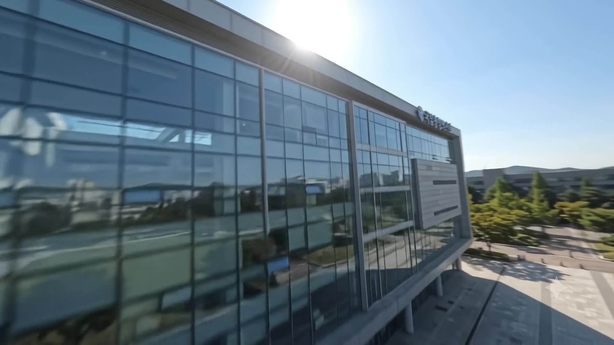
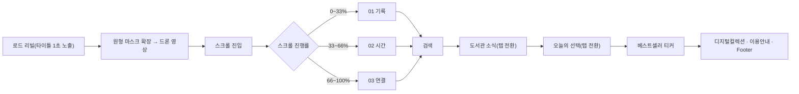

# 🏛️ 국립중앙도서관 리뉴얼 — Time Archive

> 실제 서비스가 아닌, 국립중앙도서관 홈페이지를 스크롤 기반 아카이브 경험으로 다시 그려본 개인 리뉴얼 랜딩페이지

<p>
  
  
  
  
  
  
</p>

## 🖼️ 구현 결과
| 인트로 — 드론 영상 리빌 |
|---|
|  |

스크롤 연출·영상 전환이 핵심이라 정지 이미지로는 느낌이 잘 안 살아요. 실제 스크롤 경험은 배포 링크에서 확인하는 걸 추천합니다. (화면 녹화 GIF를 추가하면 더 좋을 것 같아요.)

배포 링크: [seochaewon11.github.io/library_2](https://seochaewon11.github.io/library_2/) · [GitHub Repo](https://github.com/seochaewon11/library_2) · [Notion 기획서](https://app.notion.com/p/Project-3-c3ac080e90c0827a83c101c94d71084c)

## ✨ 주요 기능 & 인터랙션

### 1. 원형 마스크 인트로 → 드론 영상 전환
GSAP 타임라인으로 "국립중앙도서관" 타이틀을 1초 정도 띄운 뒤, 원형 마스크를 6%에서 145%까지 확장시켜 드론으로 촬영한 도서관 영상이 뻥 뚫리듯 튀어나오는 로드 리빌 연출을 만들었습니다. "TIME ARCHIVE"/"SCROLL" 안내 태그는 이 전환과 무관하게 화면에 계속 떠 있도록 별도로 분리해, 인트로가 끝나도 사용자가 다음 동작(스크롤)을 바로 알 수 있게 했습니다.

### 2. 스크롤에 고정되는 3장면 아카이브 스토리
`ScrollTrigger`로 섹션 전체를 화면에 pin한 뒤, 스크롤 진행률(progress)을 기록 → 시간 → 연결 3개 영상 장면의 인덱스로 매핑했습니다. 활성 장면의 영상만 재생하고 나머지는 정지시켜 리소스를 아끼며, 하단 고정 내비게이션의 진행 바(width %)와 점(dot)도 같은 진행률로 동기화됩니다. 인트로가 끝나자마자 검은 화면 없이 첫 장면이 바로 보이도록 강제 활성화 처리도 넣었습니다.

### 3. 도서관 소식 · 오늘의 선택 탭 전환 + 베스트셀러 무한 스크롤 티커
공지/행사/채용, 보도/카드/포토/영상 뉴스를 각각 독립된 탭 그룹으로 만들어 화면 전환 없이 콘텐츠만 바뀌게 했고, "오늘의 선택"은 신착자료/사서추천/책 읽어주는 도서관/WebDB 4개 탭에 맞는 카드를 JS 데이터 배열에서 즉시 렌더링합니다. 베스트셀러 섹션은 같은 도서 데이터를 두 번 이어 붙여 이음매 없이 반복되는 가로 스크롤 티커로 구현했습니다.

## 🧭 사용자 플로우


## 🗂️ 폴더 구조
```
├── index.html         # 전체 섹션 마크업 (인트로 → 스크롤 아카이브 → 소식/선택/베스트셀러 → 푸터)
├── script.js          # GSAP 인트로 타임라인, ScrollTrigger 장면 전환, 탭·티커 렌더링
├── style.css          # 전체 스타일 (스크롤 연출, 반응형 포함)
├── vendor/            # GSAP, ScrollTrigger 라이브러리 (로컬 번들)
├── assets/            # 인트로·스크롤 장면용 드론/아카이브 영상 4편 + 포스터 이미지
└── img/               # 도서 표지 이미지 (오늘의 선택 · 베스트셀러 공용)
```

## 🤖 AI 활용 프로세스
영상 소재는 Google Flow로 생성해 `assets/`에 그대로 반영했습니다. (실제 사용한 프롬프트를 적어주세요)

코드 초안 생성에 사용한 AI 도구와 프롬프트도 채워주세요 — 예를 들어 이전 버전(스크롤 위치를 영상 `currentTime`에 직접 매핑하는 스크러빙 방식)에서 지금의 pin 방식(스크롤 구간을 3등분해 해당 장면만 재생)으로 바꾸게 된 계기가 있다면 그 판단 과정도 좋은 내용이 될 것 같습니다.

> (①기획 ②디자인 ③개발 단계에서 실제 사용한 프롬프트를 적어주세요)

## 🩹 트러블슈팅
| 이슈 | 원인 | 해결 |
|---|---|---|
| 인트로 종료 직후 첫 장면 진입 시 화면이 잠깐 검게 끊김 | 스크롤 진입 전까지 첫 영상이 로드·재생되지 않음 | 인트로 타임라인 종료와 무관하게 첫 장면 영상을 미리 로드하고 강제로 바로 재생하도록 처리 |
| (이전 스크러빙 버전) 스크롤 위치를 영상 `currentTime`에 직접 매핑하면서 일부 구간에서 탐색이 끊겨 보임 | 스크롤마다 영상 프레임을 seek하는 방식이라 브라우저·영상 디코딩 부하에 취약 | 스크롤 구간을 3개로 나눠 해당 장면 영상만 재생/정지하는 `ScrollTrigger` pin 방식으로 재설계 |

## 📄 라이선스
MIT
